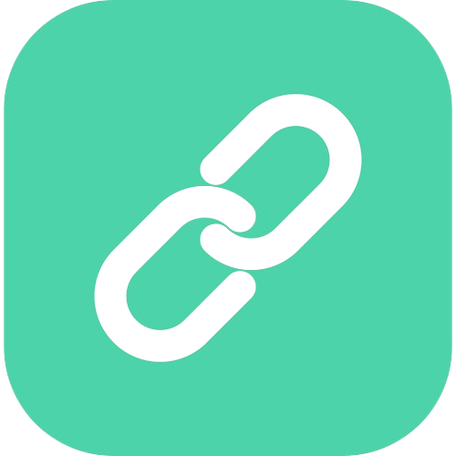

# Note App Api

Convert conplex and long urls into a simple one that makes it easy to share and use. Visit the live demo [here](https://url-shortner-seven-swart.vercel.app/)

## Features

- Sign up to create your profile.

- Login to Your account.

- Generate short link out of long URL.

- Keep track of all URL that you have created.

## Images

##### This is Sign up page

##### This is Login page

##### This is Home page

##### This is Analytics page

## Version V1.0.0

### Available Features

- Sign up to create your profile.

- Login to Your account.

- Generate short link out of long URL.

- Keep track of all URL that you have created.

### Issue

* There is an issue with changing mode of the page. It do not change it mode(light/dark) when we switch between tabs or refresh the browser.

## Setup

-  Clone the repository: `git clone https://github.com/Naitik2408/Url-Shortner-api.git`

- run `cd  Url-Shortener`

- Install dependencies by running `npm install`.

